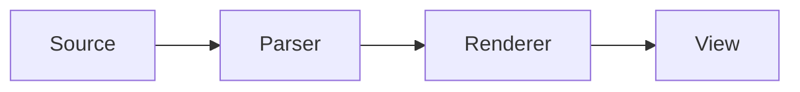

# Plugin Ecosystem

Optional packages add rendering and editing behavior without changing the core package. Install only what your documents need, instantiate each plugin once, and pass the same plugin list to the render controller and editing service.

```csharp
using ProMarkdown.Plugin.Alerts;
using ProMarkdown.Plugin.Math;
using ProMarkdown.Plugin.Mermaid;
using ProMarkdown.Plugin.SyntaxHighlighting;
using ProMarkdown.Services;

IMarkdownPlugin[] plugins =
[
    new AlertsMarkdownPlugin(),
    new MathMarkdownPlugin(),
    new MermaidMarkdownPlugin(),
    new SyntaxHighlightingMarkdownPlugin()
];

markdownView.RenderController = MarkdownRenderingServices.CreateController(plugins);
markdownView.EditingService = MarkdownRenderingServices.CreateEditingService(plugins);
```

The controller and editing service are independent so non-editable views do not need editor state. When editing is enabled, configure both with the same list so rendered elements resolve to the matching editor plugins and block templates.

## Package summary

| Package | Plugin class | Adds | Editor ID |
| --- | --- | --- | --- |
| `ProMarkdown.Plugin.Alerts` | `AlertsMarkdownPlugin` | Alert blocks, templates, editor | `AlertsMarkdownEditorIds.Block` |
| `ProMarkdown.Plugin.CustomContainers` | `CustomContainersMarkdownPlugin` | Generic fenced containers, templates, editor | `CustomContainerMarkdownEditorIds.Block` |
| `ProMarkdown.Plugin.DefinitionLists` | `DefinitionListMarkdownPlugin` | Definition-list surface, templates, editor | `DefinitionListMarkdownEditorIds.Block` |
| `ProMarkdown.Plugin.Figures` | `FiguresMarkdownPlugin` | Figure surface, templates, editor | `FiguresMarkdownEditorIds.Block` |
| `ProMarkdown.Plugin.Footers` | `FootersMarkdownPlugin` | Footer surface, templates, editor | `FooterMarkdownEditorIds.Block` |
| `ProMarkdown.Plugin.Math` | `MathMarkdownPlugin` | Inline/block math renderers, templates, editors | `MathMarkdownEditorIds.Inline`, `.Block` |
| `ProMarkdown.Plugin.Mermaid` | `MermaidMarkdownPlugin` | Mermaid parser, native SVG rendering, templates, editor | `MermaidMarkdownPlugin.MermaidEditorId` |
| `ProMarkdown.Plugin.SyntaxHighlighting` | `SyntaxHighlightingMarkdownPlugin` | Lightweight fenced-code highlighting | Renderer only |
| `ProMarkdown.Plugin.TextMate` | `TextMateMarkdownPlugin` | TextMate code rendering and AvaloniaEdit editor | `TextMateMarkdownPlugin.TextMateCodeEditorId` |

## Alerts

Use GitHub-style quoted alert blocks:

```markdown
> [!IMPORTANT]
> Save the document before switching workspaces.
>
> Nested **Markdown** remains available.
```

Recognized semantic kinds include `note`, `info`, `tip`, `success`, `important`, `warning`, `caution`, `danger`, and `error`. The renderer maps these kinds to the alert roles in `MarkdownThemePalette`; unknown kinds still render with a fallback presentation.

The editor keeps the kind selector and quoted body source synchronized and offers templates for common alert kinds.

## Custom containers

Generic custom containers use colon fences, an info token, optional arguments, and a Markdown body:

```markdown
:::warning Migration note
Back up the existing configuration before upgrading.
:::
```

The opening token selects the semantic presentation, while the remaining opening-line text becomes the title or arguments. If the body contains a colon fence, the editor increases the outer fence length to preserve valid nesting.

Use custom containers for application-specific callouts. Mermaid-specific containers are handled by the Mermaid plugin.

## Definition lists

Definition lists support one or more term lines followed by one or more definitions:

```markdown
Source map
:   A mapping from rendered text or controls back to Markdown source.

AST
Abstract syntax tree
:   The structured Markdig representation of a document.
```

The plugin renders a glossary-style surface and provides an editor for adding, removing, and rearranging complete entries while preserving nested Markdown in definitions.

## Figures

Figures use caret fences. Opening and closing captions are optional and remain separate from the body:

````markdown
^^^ Render pipeline
```text
source -> parse -> render -> source map
```
^^^ A source-aware Avalonia document surface.
````

The body can contain images, code, lists, or other supported Markdown. The editor automatically chooses an outer fence longer than caret runs in the body.

## Footers

Prefix each footer source line with `^^`:

```markdown
^^ Documentation generated from the public API.
^^ Last reviewed for ProMarkdown 0.1.
```

Footers are useful for provenance, closing notes, release context, and lightweight metadata. The editor presents the body without the source prefixes and restores them when committing.

## Math

Use single-dollar inline math and double-dollar block math:

```markdown
The distance is $d = \sqrt{x^2 + y^2}$.

$$
\int_0^1 x^2\,dx = \frac{1}{3}
$$
```

The native renderer supports identifiers, numbers, operators, fractions, roots, scripts, delimiters, accents, common symbol and function commands, styled text, and matrix/alignment-style environments. Unsupported or malformed input is represented diagnostically instead of invoking a browser engine.

`MathMarkdownPlugin` registers separate inline and block editors and a block template provider.

## Mermaid

Use a fenced code block:

````markdown

````

or a Mermaid container:

```markdown
:::mermaid
sequenceDiagram
    User->>View: Open document
    View->>Renderer: Render Markdown
:::
```

Accepted fenced aliases are `mermaid`, `mmd`, `mermaidjs`, and `diagram-mermaid`. The `diagram mermaid` descriptor form is also recognized.

The plugin renders SVG through Mermaider, sanitizes the result, applies the current Markdown palette, caches bounded results, cancels stale work, and exposes retry UI when rendering fails. Diagram work participates in `MarkdownTextBlock.IsRendering`, and palette changes regenerate the SVG without displaying a stale color variant. The editor previews changes with a short debounce and commits a safe backtick or tilde fence.

Configure localized UI text and link activation when constructing the plugin:

```csharp
var mermaidOptions = new MermaidMarkdownPluginOptions
{
    AccessibleName = "Architecture diagram",
    ErrorText = "The diagram could not be rendered.",
    RetryText = "Try again",
    ActivateLinkAsync = (uri, cancellationToken) =>
        navigation.OpenExternalAsync(uri, cancellationToken)
};

var mermaidPlugin = new MermaidMarkdownPlugin(mermaidOptions);
```

Only absolute HTTPS links survive sanitization and activation checks. When `ActivateLinkAsync` is null, the control uses the current `TopLevel` launcher. A host callback can route approved HTTPS links through application navigation or confirmation UI.

For tests, alternate engines, or host-managed rendering, inject `IMermaidSvgRenderer`:

```csharp
public sealed class ApplicationMermaidRenderer : IMermaidSvgRenderer
{
    public Task<string> RenderAsync(
        MermaidSvgRenderRequest request,
        CancellationToken cancellationToken)
    {
        return RenderSvgAsync(
            request.Source,
            request.Palette,
            request.FontFamily,
            request.FontSize,
            cancellationToken);
    }
}

var mermaidPlugin = new MermaidMarkdownPlugin(
    new ApplicationMermaidRenderer(),
    mermaidOptions);
```

The returned SVG is still passed through the plugin sanitizer. `MermaidSvgRenderRequest.Palette` is an immutable-brush snapshot that is safe to consume on a background thread.

`MermaidDiagramControl` is created by the plugin and can be targeted by application styles:

```xml
<Style xmlns:mermaid="using:ProMarkdown.Plugin.Mermaid"
       Selector="mermaid|MermaidDiagramControl">
  <Setter Property="Background" Value="{DynamicResource CardBackgroundBrush}" />
  <Setter Property="MinHeight" Value="64" />
</Style>
```

Its read-only `IsLoading`, `HasImage`, `HasError`, `ErrorText`, `SourceText`, `SourceFontSize`, `RetryText`, and `RetryCommand` properties support templates, selectors, automation, and diagnostics. `ThemePalette` is the styleable palette input used when the diagram rerenders.

## Built-in syntax highlighting

`SyntaxHighlightingMarkdownPlugin` provides a dependency-light code renderer. It recognizes language families for:

- C-style languages, including C#, JavaScript, TypeScript, Java, Go, Rust, C/C++, Swift, and Kotlin
- JSON and JSON with comments
- XML, XAML, AXAML, HTML, and SVG
- Bash, shell, Zsh, PowerShell, and `ps1`
- SQL variants
- plain text and Markdown

Unknown language hints use the general C-style tokenizer. The renderer adds a language header, line count, source mapping, and palette-aware token brushes. It does not add a separate editor; core code editing remains available.

## TextMate

`TextMateMarkdownPlugin` provides grammar-backed code rendering and an AvaloniaEdit/TextMate code editor. Known aliases include C#, JavaScript/TypeScript, JSON, Markdown, XML/XAML/AXAML, HTML, CSS, Go, Java, Python, Rust, shell, PowerShell, SQL, and YAML.

When both code-rendering plugins are registered, TextMate runs first for known grammars and the built-in highlighter acts as the fallback. Mermaid fences are left to `MermaidMarkdownPlugin`.

Choose the TextMate editor explicitly when more than one code editor is registered:

```csharp
markdownView.EditorPreferences = new MarkdownEditorPreferences()
    .PreferEditor(
        MarkdownEditorFeature.Code,
        TextMateMarkdownPlugin.TextMateCodeEditorId);
```

## Register all shipped plugins

```csharp
IMarkdownPlugin[] plugins =
[
    new AlertsMarkdownPlugin(),
    new CustomContainersMarkdownPlugin(),
    new DefinitionListMarkdownPlugin(),
    new FiguresMarkdownPlugin(),
    new FootersMarkdownPlugin(),
    new MathMarkdownPlugin(),
    new MermaidMarkdownPlugin(),
    new SyntaxHighlightingMarkdownPlugin(),
    new TextMateMarkdownPlugin()
];
```

This is useful for a Markdown workbench. Production applications should prefer the smallest set required by their content and interaction model.

To implement application-specific behavior rather than consume a shipped package, continue with [Extending ProMarkdown](../extensions/).
